# Machine to Machine (or Server to Server) authentication with Microsoft Entra ID (a.k.a Azure Active Directory)

## Entra ID Applications and service principals reminder

### Entra ID Application

- An Entra ID (AAD) Application is represented as an Application Registration in the Entra ID portal
- An AAD Application is an object that has:
  - a Display Name (can be changed)
  - an immutable AppID
  - an ObjectID (like all AAD objects)
  - it defines  properties such as Application Roles / Permissions
  - it is created in one tenant but can be marked as "Multi Tenant"
  - it has an Application Manifest that stores multiple  properties.

- An Entra ID application is necessary  to authenticate users or other application and validate the said authentication.
- An  Entra ID application can also authenticate itself to another one using a secret (password) or certificate that is stored with the Application Object

### Entra ID Service Principal

An Entra ID Service Principal is another kind of AAD object that is represented as an "Entreprise Application" in the portal :
- it is created from an AAD Application (the portal creates one automatically when an application is created)
- The Goal for a Service Principal is for the parent application to be assisgned a role or be given permission or. Role Assignment always reference service principal objectID for trustee or resource, not application IDs.
- it can be created for the application in the local tenant or any other tenant if the application is marked as "Multi-Tenant"

## Cross Tenant Discussion

While an app is created in one tenant, service principals for this app can be created in any number of tenants.

Creating a service principal for an app in one tenant means:
- a user can authenticate itself to the parent app in this tenant
- the app itself can authenticate itself in this tenant

# Machine to Machine (S2S) authentication 

the Machine to Machine or Server to Server pattern typical use case if for non-interactive use cases where one application needs to consume a service (or API) delivered by another application (or server).
This pattern aligns with the **OAuth 2.0** "**Client Credential Flow**" which ia the simpler use case where only the Client (a server) needs to authenticate to another Server with no end user involved.

## Client Credential Flow
At a very basic level, the Client Credential steps are:
- Client authenticates against Azure AD to get an access token usinh a secret or a certificate
- Client sends the access token as an "Authorization" Bearer header in the HTTP query to the server API
- Server validates token by validating the signature with the public signing keys for the target AAD instance (available on the public AAD endpoint) then can checks if:
  - the token hsa the server tenant ID in the idp claim
  - the token has the server app ID in the audience (aud) claim
  - the token has the client app ID in the appid (appid) claim
  - the token has the expected Application role in the roles claim
  - the token has the appcr claim which indicate a certificate has been used to request the token.

# Making it work across tenant

In situations where the consumer is in one tenant (customer) and the producer is in another tenant (provider) the same principle apply. To some extent this also is a very good way of understanding how AzureAD application authentication works.

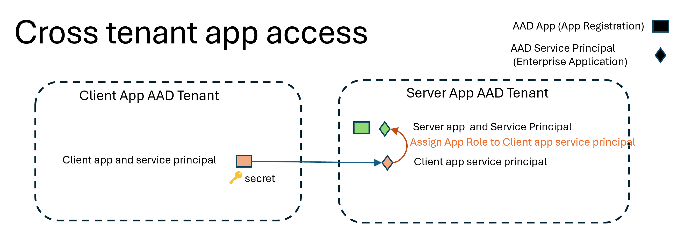

In the above schema:
- the provider has created an Application (green square) and a Service Principal for this application (green diamond) in its tenant
- the customer has created an Application (orange square) in its tenant and marked it as "MultiTenant"
- the provider has created a Service Principal for the customer application (orange diamond)in its tenant
* This allows the client app to authenticate against the provider's tenant for any Application in the provider tenant that has a service principal present,  whether the app has been declared in the provider tenant or elsewhere (such as Microsoft Graph for instance) * 


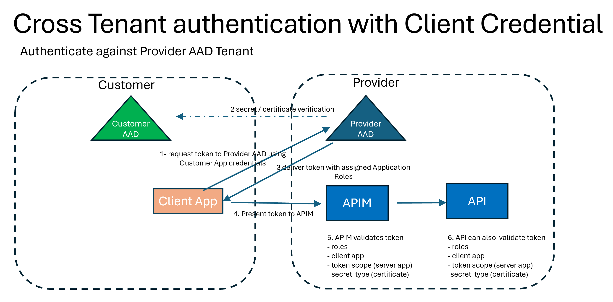

# Now the gory details..

The following paragraph will show a simplified step-by-step implentation of this mechanism in Azure AD as of 2023.

A full working example to set this up with powershell along with a companion python app  at [AzureAD-App-M2M Auth-](https://github.com/gbordier/AADM2MAuth) 


## Setting up the Applications

For our use case we will create 
- one application representing the provider API (aka server) that the client will authenticate against.
- one application representing the customer app (aka Client) that will authenticate

### Provider App in Provider AD Tenant
The Server  app will be created in the Provider AAD Tenant and will define Serveral Application Roles that can later be granted to other applications or to users.
Contrary to other user interactive use cases, Client Credential flow does not need any redirectUri since the authentication against Azure AD and the client app then submit the token to the server app in the Authorization HTTP header.

1. Create a simple Application using PowerShell: or the AAD Portal

``` powershell
connect-azuread -tenantid <ProviderTenantID>
## Create Application object in Provider Tenant
New-AzureADApplication -DisplayName "Server App" -AvailableToOtherTenants $false 


```

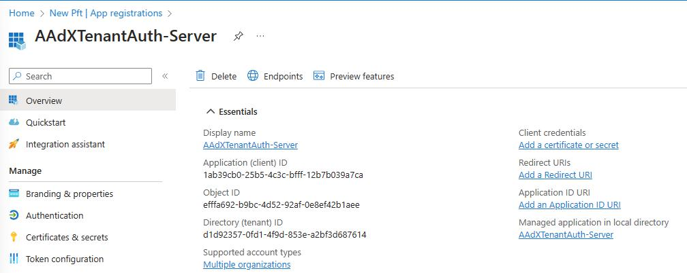

2. Create Application Roles for the Server App

``` powershell
## Create Application Roles for the Server App
$serverApp = Get-AzureADApplication -Filter "DisplayName eq 'Server App'"
$serverApp.AppRoles = $serverApp.AppRoles+= New-Object Microsoft.Open.AzureAD.Model.AppRole -Property @{"AllowedMemberTypes"="Application"; "DisplayName"="Role1"; "Id"=[guid]::NewGuid(); "IsEnabled"="true"; "Description"="Allow the application to use API1"; "Value"="Role1"}
```

| Note that application roles can be created to only be granted to other Applications or to users or both. In our case we will only grant them to other applications. |

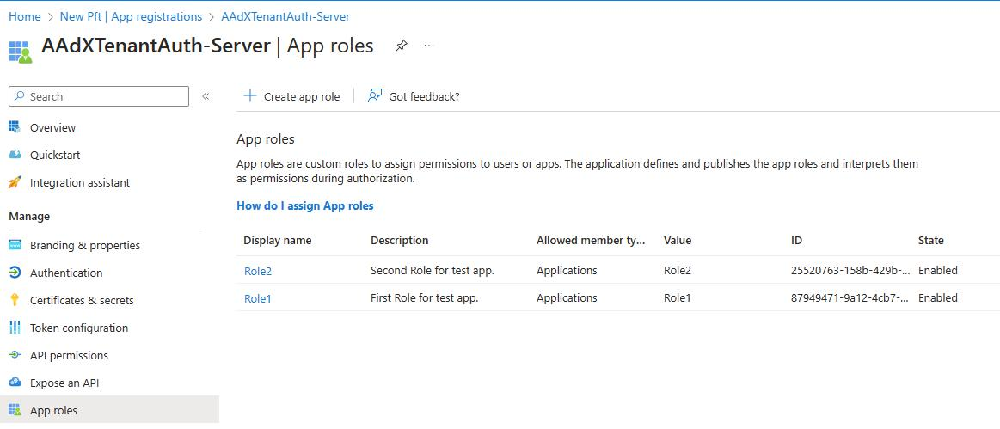


### Client App in Customer AD Tenant

Second step is to create the Client App in the Customer AD Tenant. This app will be used to authenticate against the Server App in the Provider Tenant.

``` powershell
## login to Customer Tenant
connect-azuread -tenantid <CustomerTenantID>
## Create Application object in Customer Tenant
$clientApp=New-AzureADApplication -DisplayName "Client App"
## make not of the client app Id
$clientappID = $clientApp.AppId

```

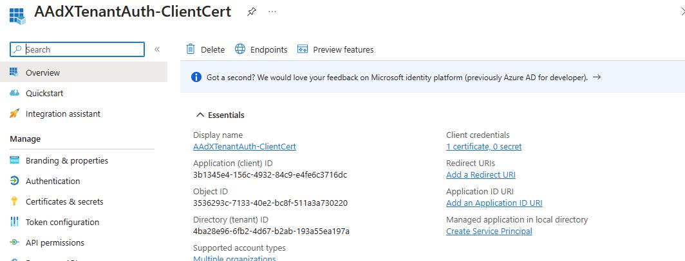


### Client App Secret in Customer AD Tenant

Next step is to create a secret for the Client App in the Customer Tenant. This secret will be used to authenticate the Client App against the Server App in the Provider Tenant.

Lets create a secret (password) and a certificate for the Client App in the Customer Tenant.

``` powershell
## create password like secret for the Client App in the Customer Tenant
$secret=New-AzureADApplicationPasswordCredential -ObjectId $clientapp.ObjectId 

```

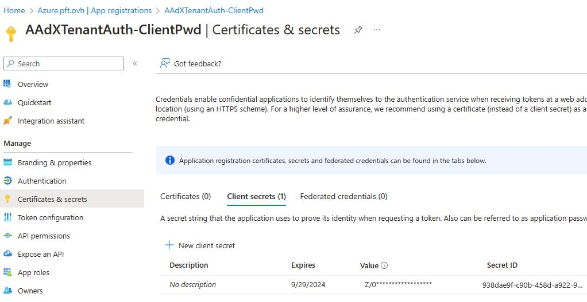

Now lets create a certificate for this Same App in the Customer Tenant.
This is done for Windows that stores the certificate in the Windows Store. 
For an side discussion about certificates and how to secure private keys see [this article]()


``` powershell

## create a certificate for the Client App in the Customer Tenant and stores in in the Windows Certificate Store, so no need to export it if you are on the same machine, to transport the private key to a different machine, the certificate must be created with the -Exportable 
$cert = New-SelfSignedCertificate -Subject "CN=ClientAppCert" -CertStoreLocation "Cert:\CurrentUser\My" -KeySpec Signature 
## then  the certificate needs to be uploaded to Azure (not the private key that stays in the Windows Certificate Store) we set the custom key identifier to the certificate hash to be able to identity the cert  later
New-AzureADApplicationKeyCredential -ObjectId $clientapp.ObjectId -CustomKeyIdentifier CustomKeyIdentifier ( [System.Convert]::ToBase64String( $cert.GetCertHash())) -Type AsymmetricX509Cert -Usage Verify -Value ([System.Convert]::ToBase64String( $cert.RawData)) -EndDate ($cert.NotAfter)

```


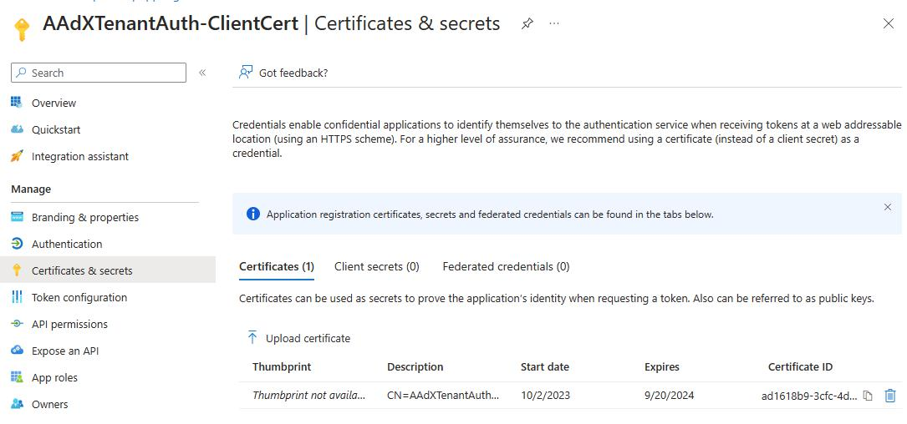


## Service Principals

Remember Service Principal represent an App in a given Tenant.
In our use case everything is happening in the provider tenant therefore all service principals involved are in the Provider tenant.

Service Principal for custom Applications cannot be created with the Azure AD portal, they must be created with PowerShell or the Graph API. A "Server" Service Principal can be made mandatory to require AppRole Assignment.

### Provider Service Principal in Provider AD Tenant

``` powershell
connect-azuread -tenantid <ProviderTenantID>
## Create Service Principal for the Server App in the Provider Tenant and make AppRol Assignment mandatory
$serversp=New-AzureADServicePrincipal -AppId $serverApp.AppId -AppRoleAssignmentRequired $true

```

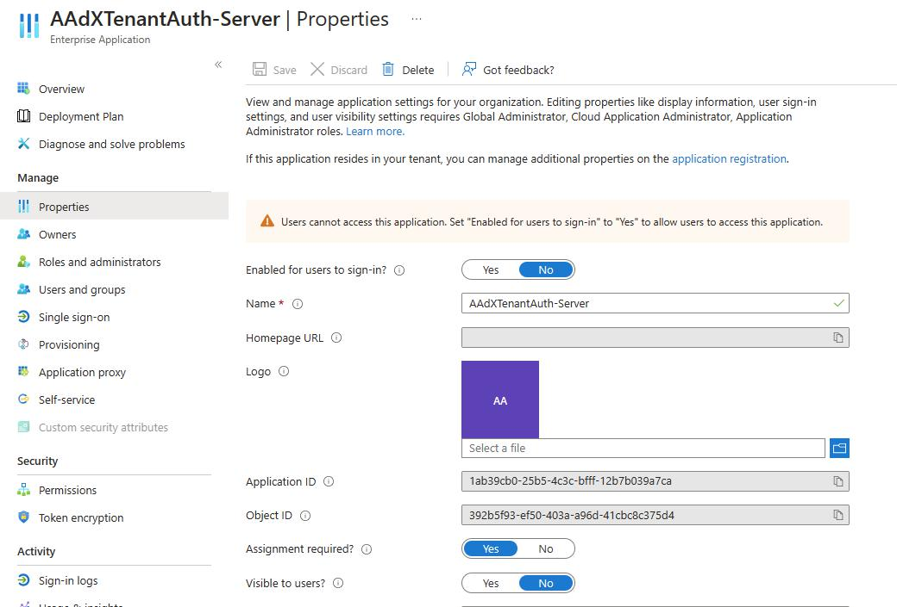


### Client Service Principal in Provider AD Tenant

Now let's create a Service Principal in the Provider tenant to represent the Client App (which only exists in the Customer Tenant)

``` powershell
## Create Service Principal for the Client App in the Provider Tenant
$clientsp=New-AzureADServicePrincipal -AppId $clientApp.AppId

```

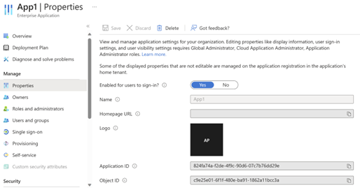

## Granting the Client App to obtain a token for  the Server App with Application Role "Role1"

This happens only in the Provider Tenant.
This can only be done using PowerShell or the Graph API.

``` powershell
## Grant the Client App to obtain a token for the Server App with Application Role "Role1"
$role = $serverApp.AppRoles | Where-Object {$_.Value -eq "Role1"}
New-AzureADServiceAppRoleAssignment -ObjectId $clientsp.ObjectId -PrincipalId $clientsp.ObjectId -ResourceId $serversp.ObjectId -Id $role.Id

```

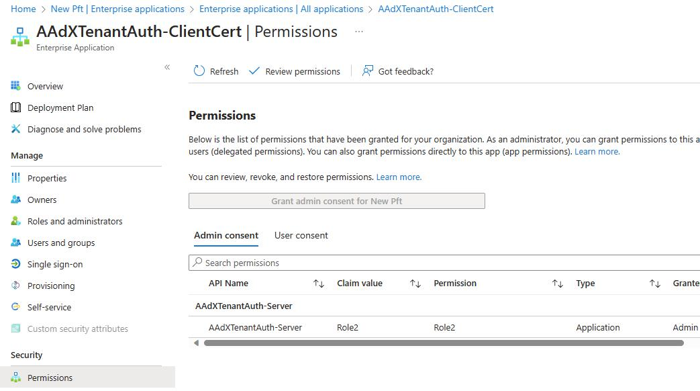


## Ok finally, let's authenticate

To demonstrate authentication I will use the MSAL.PS Powershell module that does everything we need here

First let's grab a token using the client app secret (password) in the Customer Tenant

``` powershell
$token=get-msaltoken -ClientId $clientappID -TenantId <ProviderTenantID> -Credential $secret.value

```

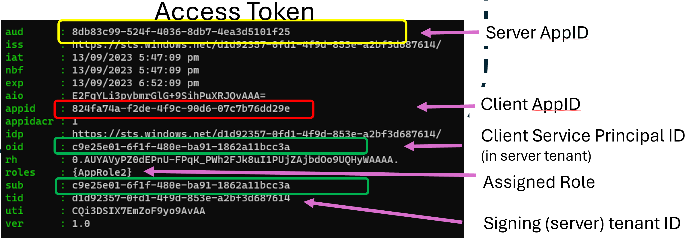

Note the token has been issued by the Provider Tenant and is valid for the Server App in the Provider Tenant.
the token contains the Application Role "Role1" that we granted to the Client App in the Provider Tenant.

- the tid claim is the tenant id of the Provider Tenant.
- the roles claim contains the Application Role "Role1" that we granted to the Client App in the Provider Tenant.
- the aud claim is the AppId of the Server App in the Provider Tenant.
- the appid and sub claims are the AppId of the Client App.
- the oid claim is the ObjectId of the Client App in the Provider Tenant.


``` powershell
$token=get-msaltoken -ClientId $clientappID -TenantId <ProviderTenantID> -certificate $cert

```

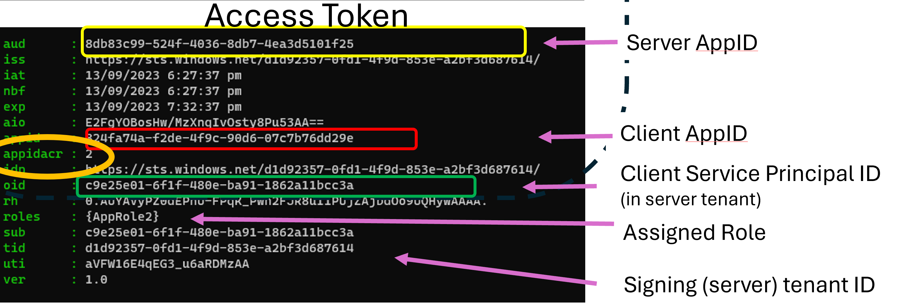

the token then includes the appidacr claim  which indicates that the token has been issued with a certificate.
This claim can take 2 values 1 for a password and 2 for a certificate.


final step is to use this token to call the Server App in the Provider Tenant.

``` powershell
invoke-restmethod -Method Get -Uri https://localhost:5001/api/values -Headers @{Authorization = "Bearer $($token.AccessToken)"}

```

# Conclusion

Entra ID application and service principals are a very mature way of performing authentication and access control leveraging one or several Azure AD Tenants. 
The API provider or the APIM needs to correctly validate claims within the issued access token but some degree of pre-validation can be made such as :
- prevent the access token from being delivered for a given audience (server API ) if no role has been assigned (using the Set-AzureADServicePrincipal -xxx on the server Service Principal)
- leverage workload identity [conditional access](https://learn.microsoft.com/en-us/azure/active-directory/conditional-access/workload-identity?toc=%2Fazure%2Factive-directory%2Fworkload-identities%2Ftoc.json&bc=%2Fazure%2Factive-directory%2Fworkload-identities%2Fbreadcrumb%2Ftoc.json) to control usage condition for workload identities.
